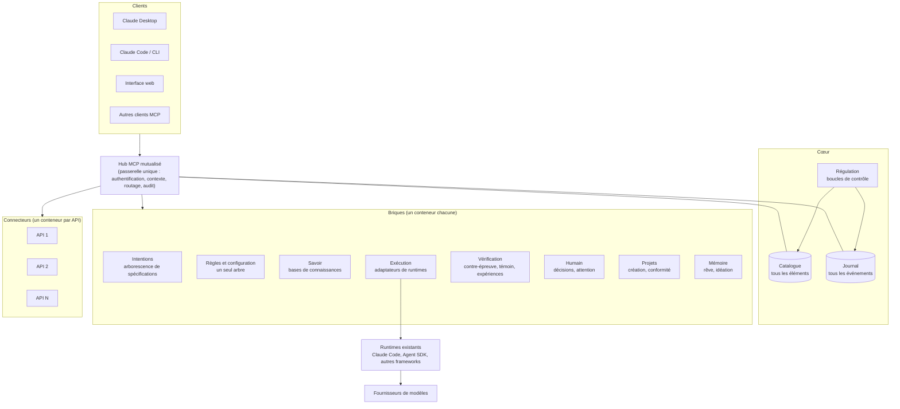

# Architecture macro — un système d'IA personnel, partageable, qui se régule

> Rédigé le 2026-10-03, **à partir de zéro** : ce document ne décrit pas le framework HOLARCH antérieur, ni la façon
> dont les projets de l'auteur sont outillés aujourd'hui ; il fixe le niveau le plus haut, celui qui doit survivre aux
> changements de technologie. le framework HOLARCH antérieur, un serveur MCP de bases de connaissances, une méthode de pilotage par
> arborescence de spécifications et les leçons de projets réels sont des **sources de leçons**, pas des contraintes. Statut : **proposition**, approuvée par l'auteur le 2026-10-03 ; l'étape 0 (§10) en dérive.

## 1. Pourquoi

L'auteur utilise l'IA au quotidien, au travail et à titre personnel, sur une dizaine de projets. Quatre constats :

1. **Les mêmes règles se dictent projet par projet**, et certaines s'oublient : des dizaines de consignes répétées sur une dizaine de projets, dont
   une bonne part se répète (choisir le bon modèle pour chaque étape, chiffrer avant une API payante, consulter la base de
   connaissances avant le fait maison, décider sans demander, hygiène de dépôt, test anti-dérive…).
2. **Ce qui se passe en coulisse est obscur** : sessions détachées, hooks, mémoires locales, coûts, refus — rien ne
   montre d'un coup d'œil ce qui est en place, ce qui tourne et ce que ça coûte.
3. **Prendre du recul rapporte plus que rapiécer** : sur plusieurs projets réels (création graphique, pilotage d'activité, base de connaissances,
   le framework HOLARCH lui-même), les gains
   sont venus d'une refonte depuis plus haut, pas d'une adaptation de l'existant ; mais rien ne déclenche ce recul.
4. **Mesuré le 2026-10-03** (expérience comparative interne « relevés », même tâche jouée par une organisation d'agents et par une session seule) : une organisation en
   équipe d'agents coûte trois fois une session seule sans faire mieux ; une **vérification par une instance neuve**
   (contre-épreuve) est la seule pièce qui a fait la différence de qualité.

## 2. Positionnement : un socle autour des runtimes d'agents, pas un de plus

**Décision de l'auteur, 2026-10-03 : on ne fait plus concurrence aux systèmes multi-agents existants** (sous-agents
et équipes de Claude Code, Agent SDK, LangGraph, CrewAI, et ceux qui viendront) : ils évoluent sans cesse, plus vite
qu'un projet personnel ne peut suivre, et l'expérience « relevés » a montré qu'une orientation maison de l'équipe
d'agents coûte sans rapporter. Le système est un **socle autour d'eux**, qui crée une synergie : il apporte ce qu'aucun
runtime ne fournit d'une session, d'un projet ou d'un outil à l'autre — **règles embarquées, visibilité (catalogue,
journal, interface), savoir vérifié, ligne directrice sur N projets, vérification indépendante, régulation, décisions
humaines au bon endroit** — et il **délègue l'orchestration** (découper, paralléliser, enchaîner les agents) au runtime
le plus adapté du moment. Un runtime meilleur demain se branche par un adaptateur ; le socle, lui, ne change pas.

Test pour toute brique : *un runtime existant le fait-il déjà, et bien ?* Si oui, on l'adapte et on le gouverne, on ne
le refait pas.

## 3. Ce que le système doit être

| Exigence | Conséquence |
|---|---|
| **Utilisé tous les jours**, au travail et chez soi | une question rapide ne paie aucune cérémonie ; la machinerie lourde ne s'active que quand la tâche la justifie (question → tâche → mission) |
| **Partageable**, en entier et brique par brique | socle générique public, profil personnel privé, niveau projet ; aucun nom, chemin ou compte dans le socle ; formats ouverts ; installation en une commande |
| **Visible** | tout ce qui existe est listé, tout ce qui se passe est journalisé, tout se voit dans une interface web agréable |
| **Qui se régule** | des boucles mesurent et corrigent (budget, progrès, qualité, usage, fraîcheur), en respectant les règles posées |
| **Qui se construit au fur et à mesure** | le système propose ses propres évolutions (règle nouvelle, brique à retirer, recul) ; l'humain approuve ce qui est irréversible ou change le contrat |
| **Durable face aux technologies** | le produit, ce sont les **contrats** (formats, interfaces, protocoles) ; chaque implémentation est un adaptateur remplaçable |
| **Cloisonné** | contextes pro, perso, client séparés : identité, données, bases, budgets, règles ; rien ne fuit d'un contexte à l'autre |
| **Modulable, configurable, évolutif** (exigence de l'auteur, 2026-10-03) | chaque brique est optionnelle et remplaçable derrière son contrat, le socle tourne avec une seule ; toute configuration est une donnée portée par un nœud de l'arbre (§5.2), héritée, surchargeable, visible et modifiable dans l'interface, jamais codée en dur ; contrats versionnés, adaptateurs remplaçables, évolutions proposées par le système et approuvées par l'humain |

## 4. Vue d'ensemble

Trois idées tiennent tout le reste :

1. **Un seul point d'entrée, le hub MCP.** Tous les clients — Claude Desktop, Claude Code, l'interface web, un autre
   outil demain — passent par lui. Derrière, chaque brique et chaque API est un service dans son propre conteneur,
   déclaré au hub (le modèle déjà utilisé au travail : un serveur MCP par API, un conteneur chacun). Le hub fédère,
   authentifie, applique le contexte (pro, perso, client), route et journalise. L'interface web n'a pas de canal
   privé : elle est un client du hub comme les autres, donc elle voit et fait exactement ce que le système permet.
2. **Un catalogue de tous les éléments.** Règle, skill, agent, profil de modèle, base de connaissances, projet,
   nœud de spécification, mission, budget, connecteur, contexte : tout élément a une fiche (identifiant, type,
   version, contexte, statut `proposé` / `actif` / `retiré`, provenance, licence, partageable ou non, mesures
   d'usage). Ce qui n'est pas au catalogue n'existe pas pour le système. C'est la réponse à « lister tous les
   éléments en place ».
3. **Un journal de tous les événements**, en ajout seul : session lancée, outil appelé, règle appliquée ou violée,
   coût, décision, vérification, refus. Ce qui n'est pas au journal ne s'est pas passé. C'est la réponse à
   « tout est obscur », et c'est la matière première de la régulation.

## 5. Les briques

Chaque brique est définie par **ce qu'elle garantit** et **son contrat** (outils exposés au hub, données qu'elle
possède, événements qu'elle émet). Son implémentation est libre et remplaçable.

### 5.1 Intentions — l'arborescence de spécifications

- **Garantit** : une ligne directrice unique qui se décline sur N projets liés, chaque travail rattaché au nœud qu'il
  sert ; recréer depuis plus haut est possible parce que le haut existe et reste à jour.
- **Structure** : ligne directrice → domaines ou activités → projets → spécifications → tranches → décisions et
  apprentissages. Chaque nœud a un statut (`brouillon`, `stable`), une approbation tracée (qui, quand), des liens vers
  ce qui le réalise.
- **Boucle d'apprentissage** (méthode de pilotage par arborescence, éprouvée sur un projet réel) : besoin qualifié → hypothèse → expérience limitée →
  observation → décision (continuer, modifier, arrêter) → remontée vers le besoin, l'hypothèse, la stratégie ; une
  tranche verticale à la fois, arrêts de validation aux points prévus (besoin validé, expérience approuvée, décision
  approuvée), sans enchaîner.
- **Repris de cette méthode**, parce que payé par l'usage :
  - un nœud = un fichier, un **type** pris dans un vocabulaire **extensible** (un registre de types, chacun avec son
    gabarit — c'est ce qui permet à un petit modèle d'écrire un nœud correct) ;
  - **liens typés** : dérive de (le parent), contraint par, dépend de, appuyé par (une observation), teste (une
    hypothèse), modifie (une décision) ;
  - **cycle de vie et autorité** : `brouillon` / `stable` / `retiré` ; seul le `stable` oblige ; l'agent n'écrit que
    des brouillons et ne passe un nœud en `stable` que comme **scribe** d'une approbation humaine tracée (qui, quand) ;
    une **revue ouverte suspend** un nœud, en disant ce qu'elle suspend et ce qu'elle laisse ; **approuver n'autorise
    pas à agir** (publier, envoyer, déployer exige une autorisation portant sur une version, une destination, des
    limites) ;
  - distinguer **fait, contrainte, préférence, hypothèse, décision** ; ne jamais inventer un fait (marqueur « à
    compléter » et question enregistrée) ; une contrainte stable ne se contourne que par une décision ;
  - **un nœud n'existe que s'il aide à décider ou à agir** : rien n'est créé à l'avance ;
  - toute automatisation est **décrite avant d'exister** (déclencheur, données, autonomie, validation, coûts, échec,
    arrêt) ; un rituel non tenu trois fois est supprimé ;
  - fraîcheur portée par le nœud (date de validité, péremption) et **acquis de méthode « payés par un fait »** ;
  - un **vérificateur** sans dépendance qui constate sans modifier.
- **Corrigé par rapport à cette méthode** (faiblesses constatées) : l'héritage y est absent — chaque nœud redéclare
  ses contraintes, ce qui coûte et s'oublie ; ici l'arbre **hérite par défaut** (§5.2) et la vue effective montre la
  provenance, ce qui garde la traçabilité sans la redéclaration. Les N projets y sont des entités sous une stratégie
  unique, sans sous-arbre ; ici chaque projet est un **vrai nœud** avec sa descendance. Les questions y sont dispersées
  entre trois registres ; ici une seule boîte de décisions (§5.6), avec débit borné (au plus N questions par jour,
  interrupteur de pause, ordre selon ce que la réponse débloque). Le journal grossit sans fin ; ici le rêve le
  consolide (§5.9). Le vérificateur y code en dur types et chemins ; ici il lit le registre des types.
- **Format ouvert** (OKF ou équivalent) : l'arborescence est un ensemble de fichiers versionnés, lisibles sans le
  système, partageables.

### 5.2 Règles et configuration — un seul arbre

- **Garantit** : une règle ou un réglage posé une fois s'applique partout où il a cours, sans qu'on le redise ; on
  généralise en le posant plus haut, on uniformise des pairs en le posant chez leur parent.
- **Un seul arbre porte tout** : socle → profil → contexte (pro, perso, client) → activité → projet → sous-projet ou
  brique. C'est le même arbre que celui des intentions (§5.1) : chaque nœud porte ses règles, sa configuration
  (budgets, profils de modèle, connecteurs, bases, identité) et ses spécifications.
- **Héritage** : ce qui est posé à un nœud vaut pour toute sa descendance.
- **Types transverses** (« app mobile », « bundle de connaissances », « site web », « API conteneurisée »…) : des
  gabarits que des projets de parents différents partagent ; un projet hérite de son parent **et** de ses types, dans un
  ordre déclaré.
- **Dérogation explicite** : un nœud peut déroger à une règle héritée, avec une raison écrite et tracée ; un nœud peut
  déclarer une règle **non dérogeable** pour sa descendance.
- **Conflits** : le plus spécifique l'emporte, sauf règle non dérogeable ; un conflit non résolu par ces deux principes
  est une décision pour l'humain, jamais un choix silencieux.
- **Remontée** : quand la même règle apparaît chez deux enfants ou plus, le système propose de la remonter au parent
  (récolte structurée) ; quand une règle du parent est dérogée par la plupart des enfants, il propose de la redescendre.
- **Règle effective** : pour chaque nœud, l'ensemble calculé, chaque élément avec sa provenance (hérité d'où, dérogé par
  qui, pourquoi) ; c'est ce que l'interface montre et ce que les adaptateurs appliquent.
- **Propagation** : changer une règle en haut met à jour tous les nœuds concernés ; les consignes des outils
  (`CLAUDE.md`, hooks, permissions, consignes de serveur MCP) sont **générées** depuis la règle effective, jamais écrites
  à la main.
- **Une règle est une donnée** : identifiant, énoncé, raison, nœud porteur, déclencheur (avant une action, après,
  périodique, à la clôture), niveau d'application, dérogeable ou non, source.
- **Niveaux d'application**, du plus sûr au plus souple : **bloquant** (garde déterministe : rien ne passe),
  **vérifié** (contrôlé après coup, écart journalisé et signalé), **guidé** (procédure chargée à la demande),
  **rappelé** (consigne toujours présente, à réserver au très court : chaque mot toujours chargé coûte à chaque tour).
- **Adaptateurs par client** : une même règle devient un hook pour Claude Code, une consigne de serveur MCP pour
  Desktop, un contrôle du moteur pour une mission. Le jour où le client change, seul l'adaptateur change.
- **Récolte** : le système repère les consignes que l'humain répète (retours, corrections, notes de mémoire, dans tous
  les projets) et propose de les promouvoir en règle ; l'humain accepte, ajuste ou refuse.

### 5.3 Savoir — les bases de connaissances

- **Garantit** : on consulte ce qu'on sait avant d'agir ; ce qu'on apprend est conservé, sourcé et à jour.
- **Lecture avant, écriture après** : un agent interroge les bases pertinentes au contexte ; ce qu'il apprend
  (recherche, expérience, décision) est proposé à la base.
- **Porte d'entrée vérifiée** : une entrée n'entre qu'après vérification contre ses sources par une instance neuve, et
  si elle change la réponse à au moins une question (test anti-dérive). Chaque entrée porte une date et une source, et
  se revalide.
- **Recherche hors entraînement** : tout fait daté après la coupure du modèle ou versionné (API, prix, modèles,
  bibliothèques) se cherche avant d'être affirmé ; une recherche dit si elle a changé une décision, et son rendement se
  mesure.
- Un serveur MCP de bases de connaissances existant (format OKF) est une implémentation candidate ; le contrat ne
  dépend pas de lui.

### 5.4 Exécution — gouverner les runtimes, pas en écrire un

- **Garantit** : une tranche s'exécute de bout en bout, dans un bac à sable, sous plafonds, avec un coût connu,
  qu'elle dure une minute ou plusieurs jours — **par le runtime existant le plus adapté** (Claude Code et ses
  sous-agents ou équipes, Agent SDK, un autre framework, un autre fournisseur), que le socle lance, borne, observe et
  vérifie au travers d'un adaptateur. Le socle n'orchestre pas les agents entre eux.
- **Cérémonie graduée** : question (aucune machinerie), tâche (une session, règles et vérification légère), mission
  (durable : reprise après coupure, réveil sur événement, plafonds cumulés) — en s'appuyant sur ce que les runtimes et
  leurs plateformes offrent déjà (tâches planifiées, sessions distantes) ; le socle ne comble que les manques.
- **Se tailler soi-même** : le profil (modèle, effort, outils) se choisit d'après une table et la nature de l'étape ;
  on commence petit et on **monte d'un cran sur échec de la vérification** ; chaque issue est journalisée et la table
  s'affine. Pour les modèles hors fournisseur principal, les classements publics servent de référence.
- **Contrat d'adaptateur de runtime** : lancer avec un profil et des plafonds, remonter les événements et le coût au
  journal, appliquer les règles par les points d'accroche du runtime (hooks, permissions, consignes), rendre les sorties
  déclarées. Un runtime qui n'offre pas un point d'accroche est gouverné après coup (vérification sur ses sorties).
- **Bac à sable par exécution** : conteneur, droits minimaux, aucun secret en clair, sorties déclarées.

### 5.5 Vérification

- **Garantit** : rien n'est déclaré fini sans avoir été éprouvé par quelqu'un qui ne l'a pas produit.
- **Contre-épreuve** : une instance neuve, sans l'historique du producteur, fabrique ses propres cas à partir de la
  spécification et rend un verdict ; un verdict négatif renvoie au producteur. Lancée par le système, pas par le
  producteur, pour qu'il ne puisse pas la biaiser.
- **Revue « page blanche »** (le recul) : la même idée appliquée à la démarche — « en repartant de zéro avec ce qu'on
  sait, ferait-on pareil ? » ; elle chiffre « adapter » contre « recréer depuis la spécification ».
- **Témoin et expériences** : pour toute automatisation importante, une comparaison à une solution simple, protocole et
  seuils fixés avant de jouer.

### 5.6 Humain — décisions et attention

- **Garantit** : l'humain décide de ce qui lui revient, en un seul endroit, sans être dérangé pour le reste.
- **Une boîte de décisions unique** : approbations, questions, propositions du système, gestes refusés aux agents
  (avec la commande prête) ; chacune avec son contexte et une recommandation.
- **L'attention est un budget**, comme l'argent : questions regroupées, résumé plutôt que flux de notifications,
  nombre de gestes manuels mesuré.
- **Délégation explicite** : ce que l'humain a déclaré pouvoir être décidé sans lui l'est, et se journalise.

### 5.7 Connecteurs

- **Garantit** : n'importe quelle API devient utilisable par tous les clients, avec des droits limités et un usage
  tracé.
- Un service MCP par API, un conteneur chacun, déclaré au catalogue avec son contexte (une API du travail n'est pas
  visible du contexte perso), ses droits et son coût éventuel (une API payante déclenche la règle « chiffrer et
  annoncer avant, essayer une pièce avant une série »).

### 5.8 Projets — création et conformité

- **Garantit** : créer un projet ne demande plus aucune corvée oubliée ; un projet existant voit d'un coup d'œil où il
  s'écarte de ses règles.
- **Créer un projet = créer un nœud** : il hérite des règles et de la configuration de ses parents et de ses types ;
  ses types déroulent une **liste d'étapes idempotentes** (rejouables sans risque) ; chaque étape qu'un agent ne peut pas
  faire arrive dans la boîte de décisions avec la commande prête.
- **Étapes typiques** (chacune optionnelle, portée par un type ou un parent, donc configurable) : dépôt (création,
  visibilité, réglages, licence, `.gitignore`, README) ; identité de commit selon le contexte ; environnement
  (conteneur de développement, clés d'accès par dépôt, accès distant) ; consignes de l'agent générées ; outillage (CI et
  sa vérification, version et journal des changements, tests et lint, obligations liées aux dépendances) ; branchements
  (connecteurs, bases de connaissances, références aux secrets, cible de déploiement, sauvegarde) ; inscription au
  catalogue, au journal et à la ligne directrice.
- **Audit de conformité** : comparer l'état réel d'un projet à sa règle effective, lister les écarts, proposer les
  corrections ; c'est aussi le chemin de migration des projets existants, sans tout refaire à la main.
- **Fin de projet** : archivage, révocation des accès, retrait du catalogue — la même mécanique à l'envers.

### 5.9 Mémoire, rêve et idéation

- **Garantit** : ce que le système vit se consolide au lieu de s'empiler ; les idées naissent, mûrissent et meurent
  selon une discipline, pas au hasard des sessions.
- **Quatre mémoires, une place chacune** : de travail (état courant et passation de chaque nœud, courte, réécrite) ;
  épisodique (le journal, en ajout seul) ; sémantique (le Savoir, §5.3) ; procédurale (les Règles et les procédures,
  §5.2). Une leçon n'a qu'une place ; le rêve la déplace là où elle doit vivre.
- **Le rêve** : une consolidation périodique et hors session (planifiée, la nuit ou à l'inactivité), à petit modèle et
  sous budget. Il rejoue le journal de la période et :
  - réorganise les mémoires de travail : fusionne les doublons, réécrit les états courants, découpe les notes trop
    longues, supprime ce qui est devenu faux, refait les index ;
  - promeut : une leçon répétée devient une proposition de règle (au bon nœud de l'arbre), un fait appris devient une
    proposition d'entrée de savoir ;
  - détecte les contradictions entre mémoires, règles et savoir, et les signale ;
  - élague : ce qui n'a servi à rien depuis longtemps est proposé au retrait ;
  - rend un **résumé du matin** dans la boîte de décisions : ce qui a changé, ce qui est proposé.

  Tout ce que le rêve modifie est versionné, donc réversible ; ce qui est irréversible ou touche une règle reste une
  proposition.
- **L'idéation**, en deux temps :
  - **divergent** : le système produit des idées à partir de ce qu'il observe (frictions répétées, coûts qui montent,
    refus, questions qui reviennent, veille ciblée) et de séances d'idéation demandées par l'humain sur un nœud ;
    chaque idée est notée dans le **carnet d'idées** du nœud, avec gain attendu, effort et source ;
  - **convergent** : le rêve trie le carnet (fusionne, classe, fait expirer ce qui dort) ; une idée ne devient un
    chantier qu'après une **mesure** qui la justifie (mesure avant réglage), et sa trace reste (prise, écartée avec le
    motif, faite avec le lien).

### 5.10 Mécanismes transverses

Ce qui ne forme pas une brique mais conditionne l'usage quotidien, au travail surtout, et le partage :

- **Classification des données et routage** : chaque nœud et chaque source portent un niveau (public, interne,
  confidentiel, sensible) ; le niveau décide quels modèles, fournisseurs, bases et connecteurs peuvent la voir (une
  donnée client confidentielle ne part jamais vers un fournisseur non autorisé, ne remonte jamais dans une base
  partagée). Le hub applique ce routage, pas l'agent.
- **Acteurs, rôles et collaboration** : un nœud se partage avec d'autres personnes (une commanditaire, des collègues),
  avec des rôles par nœud (repris de la méthode de pilotage : le **sujet** a autorité sur sa voix, ses limites, ses données et
  toute publication ; l'**opérateur** sur la structure et la méthode ; d'autres rôles par configuration). Approbations
  et décisions tracées par acteur.
- **Arrêt d'urgence et mode dégradé** : un interrupteur unique suspend toute activité autonome (exécutions, rêve,
  régulation) ; si le hub ou une brique tombe, les clients continuent avec ce qu'ils ont en local (règles bloquantes
  comprises) et rattrapent le journal au retour.
- **Réversibilité et portabilité** : tout s'exporte dans des formats ouverts (arbre, règles, savoir, journal) ;
  sauvegarde et restauration documentées ; quitter le système ne fait rien perdre.
- **Non-régression mesurée** : un changement de règle, de gabarit, d'adaptateur ou de profil de modèle se joue d'abord
  sur un **banc** (cas de référence, témoin) ; il n'est adopté que s'il ne dégrade rien de mesuré. Le banc grandit avec
  chaque incident.
- **Cadences, échéances et canaux** : rythmes de revue par niveau, échéances des expériences, rappels ; les décisions
  et le résumé du matin arrivent par le canal choisi (interface web, téléphone, messagerie), une décision s'approuve
  depuis le téléphone.
- **Documentation générée** : la documentation d'une installation, d'un projet ou d'une brique est une **vue** du
  catalogue et de l'arbre, jamais un texte maintenu à part qui dérive.

## 6. La régulation : le système qui se corrige

Une **boucle** = un signal lu dans le journal, un seuil, une action. L'action est automatique si elle est réversible et
dans les règles ; sinon elle devient une proposition dans la boîte de décisions.

| Boucle | Signal | Action |
|---|---|---|
| Budget | coût et quota consommés par contexte, projet, mission | ralentir, changer de profil, s'arrêter au plafond, prévenir avant |
| Progrès et recul | tentatives sans progrès, correctifs empilés au même endroit, coût par progrès qui monte | revue « page blanche », décision adapter / recréer |
| Qualité | verdicts de vérification, régressions | renvoi au producteur, montée de profil, alerte |
| Usage | éléments du catalogue jamais utilisés, idées jamais prises | proposition de retrait ; élagage continu |
| Fraîcheur | entrées de savoir anciennes, sources modifiées | revalidation |
| Règles | consignes répétées, violations récurrentes | proposition de règle, ajustement de niveau |
| Dérive | travail qui ne sert aucun nœud de la ligne directrice | question à l'humain avant de continuer |
| Consolidation (le rêve, §5.9) | période écoulée, mémoires qui grossissent, carnet d'idées qui s'allonge | réorganiser, promouvoir, élaguer, trier les idées, résumé du matin |

**Se construire au fur et à mesure** = ces propositions acceptées. Le système ne change jamais seul un contrat, une
règle bloquante ou une donnée d'un autre contexte.

## 7. L'interface web

Un client du hub, agréable, pour **voir, configurer, administrer**. Vues :

| Vue | Ce qu'on y voit et fait |
|---|---|
| **Tableau de bord** | ce qui tourne, ce que ça coûte aujourd'hui et ce mois-ci, les alertes, les décisions qui attendent |
| **Catalogue** | tous les éléments en place, filtrés par type, contexte, statut, usage ; leur fiche, leur historique, où ils s'appliquent |
| **Arborescence** | la ligne directrice et ses projets, l'état de chaque nœud, ce qui le réalise |
| **Exécutions** | missions et sessions : chronologie, étapes, coût, vérifications, journal détaillé |
| **Règles** | les règles actives, où et comment elles s'appliquent, leurs violations, les règles proposées par la récolte |
| **Savoir** | les bases, leur fraîcheur, les entrées en attente de vérification |
| **Décisions** | la boîte unique : approuver, refuser, répondre, déléguer |
| **Configuration** | contextes, budgets, profils de modèles, connecteurs, délégations |
| **Administration** | installation, mises à jour, sauvegarde, utilisateurs si partagé, références aux secrets (jamais les secrets) |

## 8. Partage et adaptabilité

- **Trois couches** : socle générique (public, sans rien de personnel) ; profil (privé : règles, bases, identités,
  connecteurs de la personne) ; projet. Chaque couche surcharge la précédente.
- **Les contrats sont le produit** : schémas des fiches du catalogue et des événements du journal, outils du hub,
  format de l'arborescence et des règles. Ils sont versionnés ; une implémentation se remplace sans toucher aux autres.
- **Choix techniques par défaut, révisables** : conteneurs pour tout service ; MCP comme protocole entre clients et
  briques ; fichiers versionnés pour ce qui se relit et se partage (spécifications, règles, savoir) ; une base de données
  simple pour le catalogue et le journal ; une interface web servie par le hub. Chaque choix est noté avec la raison et
  la condition qui le ferait changer.
- **Licence explicite par brique** ; secrets hors du système, dans un coffre ou l'environnement, référencés seulement.

## 9. Sécurité

Droits minimaux par conteneur et par connecteur ; contexte appliqué par le hub, pas par l'agent ; bac à sable pour
toute exécution ; gestes irréversibles ou extérieurs déclenchés par l'humain (depuis l'interface ou Desktop) ; journal
d'audit complet ; aucune donnée d'un contexte client dans une base partagée.

## 10. Construire par étapes, chacune utile seule

Le système se construit avec sa propre méthode : chaque étape est une tranche avec un **critère d'usage vérifiable**,
et la suivante ne s'ouvre que si le critère est tenu.

| Étape | Livre | Critère d'usage |
|---|---|---|
| 0. Spécifier | l'arborescence du système lui-même (ce document en tête), contrats des fiches et des événements | l'auteur l'a approuvée |
| 1. Voir | catalogue et journal, inventaire de l'existant (skills, mémoires, hooks, serveurs MCP, projets), interface web en lecture | l'auteur ouvre l'interface plutôt que de demander « qu'est-ce qui est en place ? » |
| 2. Un seul point d'entrée | hub MCP fédérant les serveurs existants et exposant le catalogue | Desktop et Claude Code passent par le hub au quotidien |
| 3. Règles et projets | arbre des règles et de la configuration, adaptateurs, récolte, création de projet, audit de conformité | plus aucune règle redictée d'un projet à l'autre pendant un mois ; un nouveau projet créé sans corvée manuelle hors gestes réservés |
| 4. Exécution et vérification | adaptateur du premier runtime (Claude Code), profils avec montée sur échec, contre-épreuve, plafonds | une tâche réelle par semaine passe par le socle, coût connu ; le second test montre un gain du runtime avec socle sur le runtime seul |
| 5. Régulation | les boucles du §6 | au moins une proposition utile par semaine acceptée, aucune action non voulue |
| 6. Savoir et intentions | bases vérifiées, arborescence reliée aux exécutions | une décision réelle s'appuie sur la base et se rattache à un nœud |

## 11. Ce que deviennent les travaux actuels

- **Le framework HOLARCH antérieur** reste la source des leçons mesurées (contre-épreuve, plafonds et journal de coût, gardes déterministes,
  coût d'une équipe d'agents maison) ; son orchestration (instances, délégation, worktrees, réveils) **n'est pas
  reconduite** : elle revient aux runtimes existants. Ce qui gouverne (vérification, plafonds, journal, gardes) est
  **réécrit contre les contrats** quand une étape l'appelle. Le second test (« adhérents ») mesure désormais la
  synergie : **un runtime seul contre le même runtime avec le socle**.
- **Un serveur MCP de bases de connaissances** (format OKF) est un candidat pour la brique Savoir et le format de l'arbre.
- **La méthode de pilotage par arborescence de spécifications** est la source de la brique Intentions.
- **Les serveurs MCP du travail** sont le modèle des connecteurs.

## 12. Décisions de l'auteur (2026-10-03)

1. **Nom** : HOLARCH est conservé — une holarchie, des touts emboîtés, décrit l'arbre et les briques.
2. **Où il tourne** : en local (WSL et conteneurs) **et** sur un petit serveur, synchronisés.
3. **Partage** : le socle est **public dès le début** ; le profil personnel (règles, bases, identités, connecteurs)
   reste privé.
4. **Modulable, configurable, évolutif** : exigence de premier rang (§3).
5. **Mémoire, rêve et idéation** : consolidation périodique hors session et carnet d'idées discipliné (§5.9).
6. **Arbre unique des règles et de la configuration**, avec généralisation vers le haut et uniformité entre pairs (§5.2) ;
   **création de projet et conformité** couvertes (§5.8).
